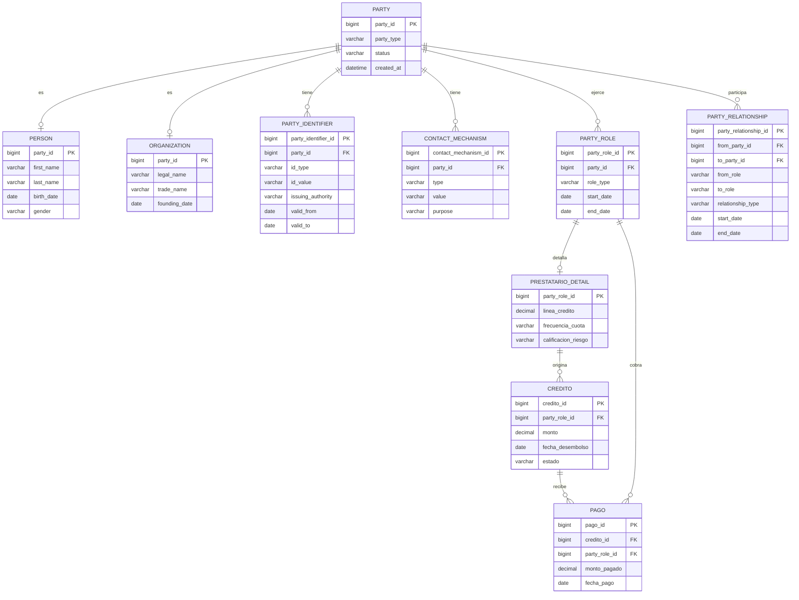

# Diagrama Entidad-Relación (TO-BE) — BGG con patrón PARTY

> Modelo lógico de ejemplo: cómo queda la base de datos de BGG **después** de migrar al patrón PARTY (estado TO-BE). Combina el núcleo genérico de PARTY (`party`, `person`, `organization`, `party_identifier`, `contact_mechanism`, `party_role`, `party_relationship` — ver `patron-party.md`) con las tablas propias del negocio de BGG (`prestatario_detail`, `credito`, `pago`), que son las que efectivamente guardan los créditos y la cobranza diaria.

**Notas de lectura de tipos y valores (fuera del diagrama, para no romper la sintaxis de Mermaid):**

- `PARTY.party_type`: `PERSON` u `ORGANIZATION`.
- `PERSON.party_id` / `ORGANIZATION.party_id`: es PK de su propia tabla y a la vez FK hacia `PARTY.party_id` (herencia 1:1).
- `PARTY_IDENTIFIER.id_type`: `DNI`, `RUC` o `CE`.
- `PARTY_ROLE.role_type`: `CLIENTE`, `PRESTATARIO`, `AVAL` o `COBRADOR`.
- `PARTY_RELATIONSHIP.relationship_type`: `AVAL`, `EMPLOYMENT` o `COBRANZA_ASIGNADA`. `from_party_id` y `to_party_id` referencian ambos a `PARTY.party_id` (por eso solo se dibuja una línea `PARTY—PARTY_RELATIONSHIP`: Mermaid no admite dos relaciones distintas entre el mismo par de entidades).
- `PRESTATARIO_DETAIL.party_role_id`: PK propia y FK hacia `PARTY_ROLE.party_role_id`, solo existe cuando `role_type = PRESTATARIO`.
- `PAGO.party_role_id`: FK hacia el `PARTY_ROLE` del cobrador que recibió el pago (`role_type = COBRADOR`).
- `CREDITO.estado`: `VIGENTE`, `CANCELADO` o `MOROSO`.

## Cómo leerlo

- **Núcleo PARTY (genérico, reutilizable en cualquier caso):** `PARTY`, `PERSON`, `ORGANIZATION`, `PARTY_IDENTIFIER`, `CONTACT_MECHANISM`, `PARTY_ROLE`, `PARTY_RELATIONSHIP`. Estas tablas son las que ya están documentadas en `patron-party.md` §4.
- **Específico del negocio de BGG:** `PRESTATARIO_DETAIL` (cuelga de `party_role_id` cuando el rol es `PRESTATARIO`), `CREDITO` y `PAGO`. Estas dos últimas son las que realmente registran el dinero prestado y las cuotas cobradas — son el contenido "real" que se mostrará en la demostración en vivo del sustento (creación/consulta de tablas + al menos un `JOIN` o subconsulta, como exige el instructivo).
- **Un mismo `party_id`** puede tener simultáneamente los roles `CLIENTE`, `PRESTATARIO` y, si además cobra para BGG, `COBRADOR` — sin duplicar su identidad, que es justamente el punto que se demuestra al comparar esto contra el modelo AS-IS (tablas separadas por rol).
- **`PARTY_RELATIONSHIP`** cubre tanto el aval (`GARANTE → PRESTATARIO`) como la asignación de cobranza (`COBRADOR → PRESTATARIO`), ambas con vigencia (`start_date`/`end_date`) para no perder el historial si se reasigna un aval o una ruta de cobro.

## Estado de este entregable

Diagrama de ejemplo para presentar el modelo lógico TO-BE. Todavía no es el script SQL final para SQL Server (pendiente de generar cuando se confirme el alcance definitivo de créditos/pagos con el equipo).
