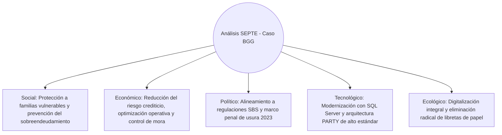

# CAPÍTULO I: INTRODUCCIÓN

## 1.1. MOTIVACIÓN DEL PROYECTO

En el contexto socioeconómico peruano contemporáneo, el acceso al financiamiento formal para microempresarios, comerciantes de mercados populares y trabajadores independientes se encuentra restringido por elevadas barreras de entrada, excesiva burocracia y estrictos requisitos crediticios impuestos por la banca tradicional. Esta exclusión financiera ha provocado una acelerada expansión del mercado de microcréditos informales bajo la modalidad comúnmente denominada **"gota a gota"**. 

De acuerdo con investigaciones del Instituto Peruano de Economía (IPE, 2024), este segmento financiero no regulado creció significativamente en los últimos años, pasando de representar el 22% del total de créditos informales en 2022 al 35% en 2024, afectando de manera directa a más de 211,000 hogares y unidades productivas en el Perú, con tasas efectivas anuales que superan el 1,400%. Ante esta realidad, la Superintendencia de Banca, Seguros y AFP (SBS) ha intensificado sus labores de monitoreo, habiendo identificado y advertido públicamente sobre más de 18 plataformas y esquemas informales de captación y colocación de dinero, mientras que el marco normativo penal peruano tipificó con mayor severidad el delito de usura y extorsión vinculada a préstamos extorsivos en el año 2023.

Dentro de este escenario opera **BGG**, una entidad de microcréditos estructurada sobre un esquema de colocación de préstamos de rápida amortización con recaudación de cuotas periódicas (diarias o semanales) ejecutadas en ruta por cobradores asignados a zonas específicas. A pesar del alto volumen de transacciones financieras diarias que maneja, BGG enfrenta una severa deficiencia técnica en la gestión y gobierno de sus datos: su operación descansa sobre un modelo de almacenamiento fragmentado e intuitivo (**estado AS-IS**), caracterizado por el uso de libros de registro físicos, hojas de cálculo dispersas o bases de datos con tablas independientes creadas por cada rol operativo (una tabla para `Clientes`, otra para `Avales` y otra para `Cobradores`).

Esta dispersión estructural genera graves anomalías operativas y financieras:
1. **Duplicación de identidades y redundancia de datos:** Cuando un cliente asume el rol de aval o garante de un familiar o colega comerciante, sus datos personales, teléfonos y direcciones se registran repetidamente en diferentes archivos, generando inconsistencias ante cambios de domicilio o números de contacto.
2. **Opacidad en el riesgo de garantías cruzadas:** La administración carece de visibilidad consolidada para determinar cuántos préstamos activos se encuentran respaldados simultáneamente por un mismo aval, lo que distorsiona la capacidad real de pago y eleva el riesgo de incobrabilidad y sobreendeudamiento encubierto.
3. **Pérdida de trazabilidad histórica en la cobranza:** No existe un registro relacional continuo y fechado de las reasignaciones de rutas entre cobradores y deudores, imposibilitando la rendición de cuentas ante faltantes de caja, reprogramaciones de deuda o auditorías forenses.

Frente a esta problemática, la motivación del presente proyecto radica en diseñar e implementar una solución de ingeniería de datos relacional robusta, normalizada y segura sobre **Microsoft SQL Server**, adoptando el patrón arquitectónico universal **PARTY** (Silverston, 2001). Dicha propuesta traslada a BGG a un **estado TO-BE**, en el cual la identidad ontológica de los sujetos se centraliza de forma inmutable, sus funciones de negocio se manejan como roles dinámicos y sus interacciones se modelan como un grafo relacional dirigido y auditable temporalmente.

---

## 1.3. PROPUESTAS

> *Nota de formato: Se mantiene la correlatividad 1.1 a 1.3 de acuerdo con la nomenclatura oficial de la plantilla institucional provista para el proyecto.*

Con la finalidad de resolver la problemática operativa y de información de BGG, el equipo de ingeniería formuló y evaluó tres alternativas tecnológicas y de arquitectura de datos:

### Propuesta 1: Sistema de Registro Tradicional en Hojas de Cálculo Descentralizadas
- **Descripción:** Mantener la operatividad mediante libros de cálculo en Microsoft Excel o Google Sheets compartidos entre los supervisores y cobradores, organizados en hojas tabulares independientes por zona geográfica y por rol (pestaña de Clientes, pestaña de Avales y pestaña de Liquidación de Cobradores).
- **Ventajas:**
  - Costo de licenciamiento e infraestructura prácticamente nulo.
  - Curva de aprendizaje inmediata para el personal operativo de campo y administrativo.
  - Flexibilidad rápida para agregar columnas sin restricciones de integridad.
- **Desventajas:**
  - Nula concurrencia segura; alta vulnerabilidad a sobreescritura accidental y corrupción de archivos.
  - Imposibilidad de garantizar integridad referencial y consistencia de datos (inexistencia de claves foráneas y restricciones ACID).
  - Alto riesgo de fuga de información y carencia total de políticas de seguridad granular a nivel de registros o columnas.
  - Cero capacidad de auditoría histórica automatizada ante modificaciones maliciosas en los montos de amortización.

### Propuesta 2: Base de Datos Relacional Clásica con Tablas Aisladas por Rol (Modelo AS-IS)
- **Descripción:** Implementar una base de datos relacional estructurada bajo el enfoque convencional o ingenuo de diseño, donde cada rol operativo del negocio se materializa en una tabla independiente (`tbl_Clientes`, `tbl_Avales`, `tbl_Cobradores`, `tbl_Prestamos`), replicando en cada una los campos de nombres, apellidos, documento de identidad, dirección y teléfono.
- **Ventajas:**
  - Facilidad inicial de modelado y comprensión conceptual directa para programadores júnior.
  - Estructura relacional básica con soporte para transacciones ACID y consultas SQL simples.
  - Reducción del número de uniones (`JOIN`) en consultas transaccionales elementales.
- **Desventajas:**
  - Duplicación severa de registros cuando una misma persona ejerce múltiples funciones de negocio (ej. un cliente que avala a otro o un cobrador que solicita un préstamo).
  - Inconsistencia semántica: la actualización de datos de contacto en una tabla no se propaga a las demás tablas donde el sujeto existe.
  - Proliferación de columnas con valores nulos (`NULL`) para representar atributos no aplicables a personas jurídicas o garantes sin línea de crédito activa.
  - Esquema rígido que exige modificaciones destructivas del DDL (`ALTER TABLE`) cada vez que surge un nuevo rol o vínculo operativo.

### Propuesta 3: Base de Datos Relacional Centralizada con Patrón de Modelado PARTY y Roles Dinámicos (Modelo TO-BE)
- **Descripción:** Diseñar e implementar un esquema relacional avanzado en Microsoft SQL Server basado en el arquetipo universal **PARTY** (Silverston, 2001). En esta arquitectura se separa ontológicamente la identidad (`PARTY`, `PERSON`, `ORGANIZATION`), los identificadores administrativos (`PARTY_IDENTIFIER`), los mecanismos de localización (`CONTACT_MECHANISM`), las funciones temporales asumidas (`PARTY_ROLE`, `PRESTATARIO_DETAIL`) y las relaciones inter-partes (`PARTY_RELATIONSHIP`), acoplando el módulo transaccional de microfinanzas (`CREDITO`, `PAGO`).
- **Ventajas:**
  - Eliminación absoluta de la redundancia y duplicación de identidades (un único `party_id` inmutable por individuo u organización).
  - Flexibilidad total para asignar, revocar y superponer roles de negocio sin alterar la estructura física de la base de datos.
  - Trazabilidad y auditoría temporal inmanente mediante rangos de vigencia (`start_date`, `end_date`) en asignaciones de cobranza y avales cruzados.
  - Modelo formalmente normalizado en 3FN y BCNF con soporte estricto de integridad referencial, seguridad RBAC y planes de contingencia automatizados en SQL Server.
- **Desventajas:**
  - Mayor complejidad conceptual en el modelado y necesidad de capacitación técnica del equipo de desarrollo.
  - Sobrecarga de uniones (`JOIN`) en consultas transaccionales de lectura masiva, requiriendo la creación de vistas y optimización mediante índices compuestos.

---

## 1.4. IMPACTOS

El desarrollo y despliegue del proyecto en BGG genera impactos multidimensionales evaluados bajo el estándar de ingeniería:

### 1.4.1. Impacto social
El proyecto proporciona transparencia operativa y visibilidad real sobre el endeudamiento de los microcomerciantes y sus familias. Al impedir el sobreendeudamiento encubierto mediante avales cruzados invisibles, se contribuye a mitigar el estrés financiero y las situaciones de vulnerabilidad social y económica que históricamente afectan a los prestatarios de créditos informales en los sectores populares del país.

### 1.4.2. Impacto cultural
Fomenta una cultura organizacional orientada a la formalización, el rigor de datos y la disciplina en la gestión de la información. Sustituye las prácticas consuetudinarias y empíricas de confianza verbal y anotaciones informales en libretas por un registro digital trazable, inculcando en administradores y cobradores estándares modernos de responsabilidad de datos.

### 1.4.3. Impacto político
Contribuye al cumplimiento de las directrices y advertencias emitidas por los órganos reguladores del Estado peruano (SBS e INDECOPI) y se alinea con las reformas al Código Penal de 2023 respecto a la lucha contra la usura y la opacidad en operaciones crediticias. La base de datos dota a la organización de capacidad probatoria e histórica auditada ante requerimientos de información por parte de las autoridades competentes.

### 1.4.4. Impacto ambiental
Impacta positivamente en el medio ambiente mediante la desmaterialización de procesos. La digitalización centralizada de los contratos de préstamo, cronogramas de pago y recibos de recaudación diaria elimina la necesidad de miles de formularios preimpresos, cartillas físicas y cuadernos de control en ruta, reduciendo el consumo de papel y la huella de carbono asociada al manejo documental físico.

### 1.4.5. Impacto ético
Garantiza el tratamiento ético y confidencial de la información personal de los prestatarios y garantes. La incorporación de políticas de seguridad granular (DCL), segregación de funciones entre cobradores y administradores, y cifrado de datos sensibles previene el uso indebido de los datos domiciliarios y de contacto para fines extorsivos o de acoso ilegal.

### 1.4.6. Impacto económico
Optimiza la rentabilidad y sostenibilidad financiera de la entidad al reducir drásticamente la tasa de morosidad mediante la evaluación rigurosa del historial de los prestatarios y la detección temprana de concentración indebida de riesgos en avales insolventes. Asimismo, elimina los costos derivados de pérdidas operativas, descuadres de caja de cobradores y tiempos muertos en la consolidación manual de información.
