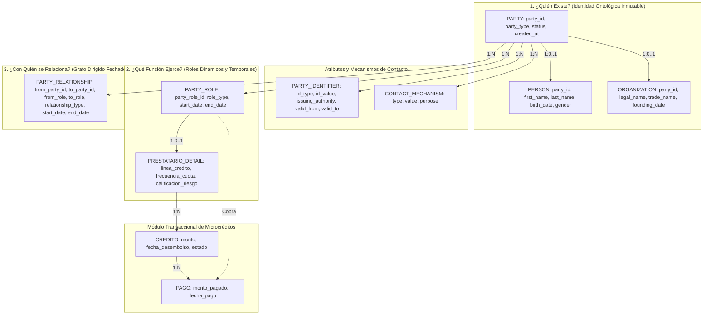

# CAPÍTULO II: MARCO TEÓRICO

## 2.1. ANTECEDENTES TEÓRICOS

En cumplimiento de las normas de integridad académica y el rigor metodológico del proyecto, los antecedentes presentados reflejan fuentes bibliográficas reales y verificables, así como los marcadores formales correspondientes a los tópicos de investigación empírica en proceso de consolidación por parte del equipo de trabajo:

### Antecedente 1: El Patrón Universal de Modelado de Datos PARTY
- **Referencia:** Silverston, L. (2001). *The Data Model Resource Book, Vol. 1: A Library of Universal Data Models for All Enterprises* (Revised Edition). John Wiley & Sons, Inc.
- **Objetivo:** Desarrollar un marco universal de patrones de datos relacionales estandarizados y reutilizables para modelar entidades complejas en organizaciones corporativas e industriales.
- **Metodología:** Análisis ontológico y taxonómico de esquemas relacionales empresariales a gran escala, descomponiendo los dominios de clientes, proveedores, recursos humanos y socios de negocio en estructuras atómicas de identidad, roles dinámicos y relaciones temporales dirigidas.
- **Resultados:** Estableció formalmente el arquetipo de modelado **PARTY**, demostrando conceptualmente que la separación estricta entre la entidad primaria (`Party`), las clasificaciones por subtipo (`Person` y `Organization`), los roles transitorios (`Party Role`) y las relaciones inter-entidades (`Party Relationship`) elimina la duplicidad de datos frente a modelos tradicionales basados en tablas estáticas por rol, garantizando la escalabilidad y extensibilidad del esquema sin necesidad de alterar el DDL del motor de base de datos. *(Nota: el libro es un catálogo de patrones conceptuales; no reporta una cifra empírica de reducción de duplicidad — esa medición cuantitativa la aporta este proyecto al comparar AS-IS vs. TO-BE con datos reales de BGG).*

### Antecedente 2: Gestión de Microcréditos y Finanzas Populares
`[PENDIENTE: buscar antecedente real sobre microfinanzas y créditos informales — no inventar]`
*(Nota para la versión final: El equipo incorporará aquí un artículo científico indexado en Scopus/SciELO sobre modelamiento de datos en instituciones microfinancieras).*

### Antecedente 3: Dinámica Socioeconómica del Préstamo "Gota a Gota" y Cobranza en Ruta
`[PENDIENTE: buscar antecedente real sobre el fenómeno socioeconómico del préstamo "gota a gota" y cobranza en ruta — no inventar]`
*(Nota para la versión final: El equipo incorporará aquí un estudio sociológico/financiero nacional sobre la operativa de recaudación diaria en campo).*

### Antecedente 4: Arquitecturas de Bases de Datos Relacionales para el Control Crediticio
`[PENDIENTE: buscar antecedente real sobre bases de datos relacionales aplicadas a microfinanzas / gestión crediticia — no inventar]`
*(Nota para la versión final: El equipo incorporará aquí una tesis de ingeniería de sistemas sobre sistematización de carteras de crédito y cobranza).*

### Antecedente 5: Modelamiento de Trazabilidad y Riesgo en Garantías y Avales
`[PENDIENTE: buscar antecedente real sobre arquitecturas de datos para trazabilidad y auditoría de garantías/avales — no inventar]`
*(Nota para la versión final: El equipo incorporará aquí una investigación académica sobre matrices de riesgo cruzado y auditoría temporal de deudores y garantes).*

---

## 2.2. BASES TEÓRICAS

### 2.2.1. Teoría de Bases de Datos Relacionales y Propiedades ACID
El modelo relacional, propuesto formalmente por Edgar F. Codd en 1970, fundamenta el almacenamiento de la información en estructuras lógicas tabulares compuestas por tuplas (filas) y atributos (columnas), sustentadas en la teoría matemática de conjuntos y la lógica de predicados de primer orden. En los sistemas de gestión de bases de datos relacionales (RDBMS) de clase empresarial, como Microsoft SQL Server, el procesamiento transaccional se encuentra regido por las propiedades **ACID**:
- **Atomicidad (Atomicity):** Garantiza que una transacción constituya una unidad indivisible de trabajo; si una operación individual falla (por ejemplo, registrar un pago pero fallar en actualizar el saldo del crédito), la transacción completa se revierte (`ROLLBACK`).
- **Consistencia (Consistency):** Asegura que cualquier transición de estado preserve todas las restricciones de integridad declarativas (`PRIMARY KEY`, `FOREIGN KEY`, `CHECK`, `UNIQUE` y `NOT NULL`).
- **Aislamiento (Isolation):** Define el nivel en que las operaciones concurrentes son invisibles entre sí antes de confirmarse (`COMMIT`), evitando lecturas sucias, lecturas no repetibles y registros fantasmas mediante mecanismos de bloqueo y control de versiones de filas.
- **Durabilidad (Durability):** Asegura que una vez confirmada una transacción mediante la escritura en el registro de transacciones (*Transaction Log* o LDF), sus efectos permanezcan inalterables incluso ante caídas catastróficas del sistema o fallas de suministro eléctrico.

### 2.2.2. El Patrón de Modelado PARTY: Identidad Centralizada, Roles y Relaciones
En los diseños convencionales o ingenuos de bases de datos, las organizaciones tienden a crear una tabla física independiente para cada figura operativa (`Clientes`, `Proveedores`, `Empleados`, `Avales`). Este enfoque colapsa en dominios con alta interacción humana y multifuncionalidad, originando duplicación de identidades, proliferación de valores nulos y pérdida de coherencia histórica.

El patrón de modelado **PARTY** (Silverston, 2001) resuelve estas patologías mediante la aplicación del principio de responsabilidad única (SRP) a nivel de arquitectura de datos, dividiendo el dominio en tres dimensiones fundamentales:

#### A. Núcleo de Identidad (Class Table Inheritance)
Representa a cualquier sujeto de derecho capaz de interactuar con el negocio mediante una superclase abstracta (`PARTY`), cuya clave primaria artificial subrogada (`party_id`) es heredada directamente como clave primaria y clave foránea simultánea por las subclases especializadas `PERSON` (personas naturales) y `ORGANIZATION` (personas jurídicas o negocios comerciales). Esto elimina las columnas nulas cruzadas (ej. no existen campos de "Razón Social" en personas ni "Apellidos" en empresas).

#### B. Desacoplamiento de Identificadores Administrativos (`PARTY_IDENTIFIER`)
Los documentos emitidos por entidades gubernamentales (DNI emitido por RENIEC, RUC emitido por SUNAT, Carné de Extranjería emitido por Migraciones) no constituyen la identidad ontológica de un individuo, sino credenciales administrativas. El patrón modela estos documentos en una tabla satélite que vincula múltiples documentos vigentes o históricos a un único `party_id`.

#### C. Roles de Negocio Dinámicos y Temporales (`PARTY_ROLE`)
Un sujeto no "es" un cliente o un cobrador de manera estática y exclusiva, sino que "actúa" en determinado rol durante una ventana temporal delimitada por `start_date` y `end_date`. Esto permite que una misma persona natural conserve un único `party_id` y asuma simultáneamente los roles de `CLIENTE`, `PRESTATARIO`, `AVAL` o `COBRADOR`, adjuntando extensiones de datos especializadas (como `PRESTATARIO_DETAIL`) sin ensuciar la entidad raíz.

#### D. Vínculos Dirigidos y Temporales entre Partes (`PARTY_RELATIONSHIP`)
Modela las interacciones directas entre dos entidades (`from_party_id` y `to_party_id`) bajo un grafo relacional fechado. En BGG, este componente resuelve de manera elegante las relaciones de garantía cruzada (`AVAL`), contratos laborales (`EMPLOYMENT`) y asignación geográfica de rutas de cobro (`COBRANZA_ASIGNADA`). La regla fundamental de auditoría prohíbe las eliminaciones físicas (`DELETE`); cualquier cambio en una relación se gestiona cerrando la vigencia (`end_date = CURRENT_TIMESTAMP`) e insertando una nueva tupla activa.

---

## 2.3. ANÁLISIS DEL PROBLEMA

### 2.3.1. IDENTIFICACIÓN Y FORMULACIÓN DEL PROBLEMA

#### Realidad Problemática: Diagnóstico AS-IS
En su operatividad diaria, la entidad de microcréditos **BGG** otorga préstamos de rápido desembolso a pequeños comerciantes y trabajadores independientes, recuperando el capital e intereses mediante cobranzas periódicas en ruta. En el estado actual (**AS-IS**), la entidad gestiona su información mediante un esquema fragmentado por roles, lo que origina graves disfunciones operativas:
1. **Inconsistencia y Redundancia:** Datos como números de celular, direcciones de domicilio y referencias familiares se encuentran replicados y desfasados en múltiples registros.
2. **Ceguera de Riesgo Crediticio en Avales:** Si un cliente que actúa como aval de tres prestatarios distintos entra en mora o abandona su domicilio comercial, el sistema AS-IS es incapaz de alertar a los administradores sobre el riesgo sistémico de las cuatro operaciones vinculadas.
3. **Falta de Trazabilidad en Rutas de Cobro:** Ante reclamos por cuotas no liquidadas o cambios de cobrador asignado a una zona, no existe un registro histórico que relacione inequívocamente al deudor, al cobrador en turno y a la fecha exacta de recaudación.

#### Formulación del Problema General de Ingeniería
¿De qué manera el diseño e implementación de una base de datos relacional basada en el patrón de modelado PARTY optimiza la gestión de identidad, control de avales y trazabilidad histórica de cobranzas en la entidad de microcréditos BGG?

### 2.3.2. DEFINICIÓN DE OBJETIVOS

#### Objetivo General
Diseñar e implementar una base de datos relacional para la entidad de microcréditos **BGG** que centralice la identidad de cada persona y organización bajo el patrón de modelado PARTY, eliminando la duplicidad de datos y garantizando la trazabilidad histórica de créditos, avales y recaudaciones en ruta sobre Microsoft SQL Server, comparando el estado actual (AS-IS) frente al modelo migrado (TO-BE) para evidenciar cuantitativa y cualitativamente los beneficios de la solución.

#### Objetivos Específicos
1. **Relevar y formalizar los requerimientos del negocio:** Capturar las reglas operativas, necesidades de los stakeholders y casos de uso transaccionales de BGG mediante matrices estructuradas de requerimientos funcionales y no funcionales.
2. **Diseñar el modelo conceptual y lógico de datos:** Estructurar el esquema entidad-relación aplicando la arquitectura hub-and-spoke del patrón PARTY (identidad, identificadores, contactos, roles y relaciones) acoplado al módulo de colocaciones y pagos.
3. **Ejecutar el proceso formal de normalización:** Demostrar el paso del modelo desnormalizado AS-IS hacia un modelo TO-BE en Tercera Forma Normal (3FN) y Forma Normal de Boyce-Codd (BCNF).
4. **Implementar el modelo físico y migración en Microsoft SQL Server:** Construir los scripts DDL optimizados con tipos de datos precisos, restricciones de integridad referencial, checks y procedimientos transaccionales ACID.
5. **Establecer políticas de seguridad y planes de contingencia:** Definir roles de base de datos con privilegios granulares basados en el principio de menor privilegio y estructurar una política automatizada de copias de seguridad (Full, Diferencial, Log) con protocolos de restauración probados.
6. **Contrastar requerimientos y evaluar el desempeño:** Validar la cobertura total de los requerimientos de BGG mediante consultas analíticas avanzadas y verificación de integridad transaccional.

### 2.3.3. ALCANCE DE LA SOLUCIÓN

#### Fronteras y Módulos Comprendidos
El proyecto abarca la totalidad del ciclo de vida de los datos para la gestión crediticia y de cobranzas de BGG:
- Centralización del padrón de personas naturales y organizaciones.
- Registro multicanal de identificadores gubernamentales (DNI, RUC, CE) y puntos de contacto.
- Asignación dinámica y temporal de roles (Cliente, Prestatario, Aval, Cobrador).
- Trazabilidad y auditoría histórica de avales cruzados y asignaciones de cobradores en ruta.
- Registro transaccional de colocación de créditos, planes de amortización y cobranza diaria/semanal.
- Seguridad RBAC y planes de respaldo/recuperación en Microsoft SQL Server.

#### Posturas y Funcionalidades Fuera de Alcance (No Soportadas)
Con la finalidad de delimitar estrictamente las fronteras de ingeniería del proyecto, se declaran como **no soportadas** las siguientes funcionalidades:
1. **Rastreo GPS en tiempo real de cobradores:** El sistema no incluye captura de telemetría geoespacial en vivo ni geocercas satelitales para los dispositivos móviles de los cobradores.
2. **Pasarelas de pago bancarizadas y procesamiento de tarjetas:** El modelo se circunscribe al registro relacional y liquidación de operaciones en efectivo o transferencias manuales; no implementa integración directa con redes interbancarias (SWIFT, VISA, Mastercard) ni servicios de pago digital en tiempo real.
3. **Facturación electrónica homologada ante SUNAT:** No se incluye la emisión de comprobantes de pago electrónicos bajo el estándar UBL 2.1 ni conexión con Proveedores de Servicios Electrónicos (PSE).
4. **Módulo de contabilidad general corporativa:** El alcance no comprende balance general, libro diario contable ni estados de ganancias y pérdidas bajo normas NIIF.
