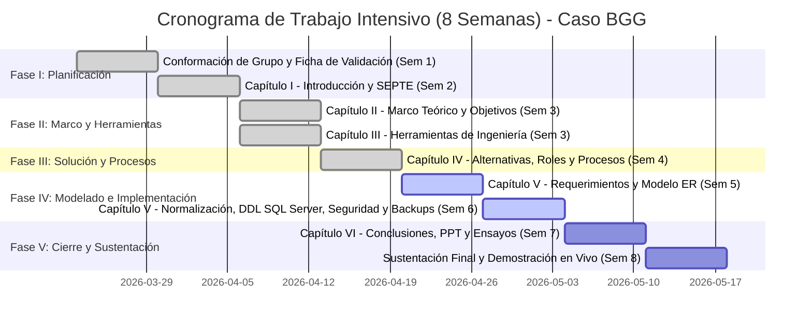
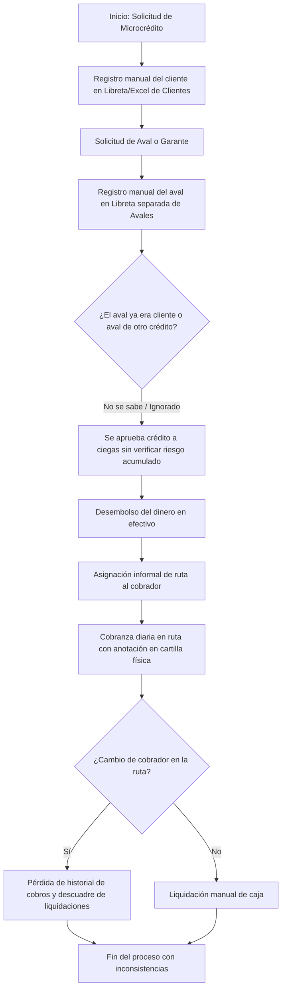
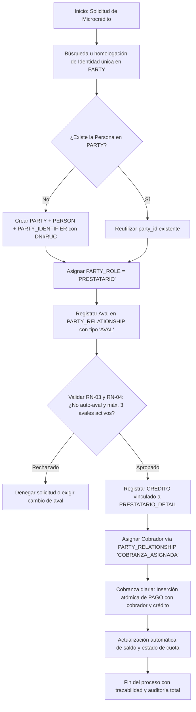

# CAPÍTULO IV: GENERACIÓN DE SOLUCIONES

## 4.1. ALTERNATIVAS DE SOLUCIÓN

Para seleccionar de manera objetiva la solución tecnológica y de arquitectura de datos más adecuada para la entidad de microcréditos **BGG**, se aplicó una matriz de decisión cuantitativa que evalúa las tres alternativas propuestas en el Capítulo I frente a cinco criterios de ingeniería, calificados en una escala de 0 a 10 (donde 0 representa la menor viabilidad o peor desempeño, y 10 la máxima viabilidad o excelencia técnica):

### Matriz Cuantitativa de Evaluación de Alternativas

| Criterio de Selección | Ponderación | Propuesta 1: Hojas de Cálculo Descentralizadas | Propuesta 2: BD Relacional Clásica por Rol (AS-IS) | Propuesta 3: BD Relacional con Patrón PARTY (TO-BE) |
|:---|:---:|:---:|:---:|:---:|
| **1. Costos de Licenciamiento e Infraestructura** | 15% | 10 (1.50) | 8 (1.20) | 8 (1.20) |
| **2. Facilidad en Recopilación de Información** | 15% | 8 (1.20) | 7 (1.05) | 9 (1.35) |
| **3. Dominio Técnico y Respaldo Teórico** | 20% | 9 (1.80) | 8 (1.60) | 9 (1.80) |
| **4. Integridad, Normalización y Seguridad** | 30% | 1 (0.30) | 5 (1.50) | 10 (3.00) |
| **5. Escalabilidad y Trazabilidad Histórica** | 20% | 1 (0.20) | 4 (0.80) | 10 (2.00) |
| **TOTAL PONDERADO** | **100%** | **5.00** | **6.15** | **9.35** |

### Sustento de la Elección Técnica
- **Descarte de la Propuesta 1 (5.00/10):** Aunque presenta costo cero y adopción inmediata, carece totalmente de integridad referencial, seguridad granular y capacidad transaccional ACID, resultando inaceptable para una operación financiera con manejo de dinero en efectivo y cobros en ruta.
- **Descarte de la Propuesta 2 (6.15/10):** Si bien incorpora un motor relacional, su arquitectura basada en tablas aisladas por rol reproduce las fallas estructurales del estado AS-IS (duplicación de personas cuando son clientes y avales a la vez, amnesia histórica al reasignar cobradores y proliferación de campos nulos).
- **Elección de la Propuesta 3 (9.35/10):** La arquitectura relacional sustentada en el patrón universal **PARTY** e implementada sobre **Microsoft SQL Server** obtiene la máxima puntuación en integridad, normalización formal, seguridad RBAC y trazabilidad histórica mediante vigencias, resolviendo de raíz todas las patologías del negocio de BGG.

---

## 4.2. CRONOGRAMA DEL PROYECTO

> **Nota metodológica sobre el cronograma:** La plantilla estándar de la institución presenta un esquema referencial de 16 semanas. Sin embargo, en concordancia con la modalidad del curso en el sistema modular intensivo de la UPN (periodo 2026-1), el cronograma real y efectivo del proyecto se estructuró en **8 semanas de trabajo acelerado**, avanzando en paralelo el modelado documental y la construcción de scripts en SQL Server desde la Semana 4.

---

## 4.3. ROLES Y RESPONSABILIDADES EN EL PROYECTO

La ejecución del proyecto involucra de forma activa y equitativa a los cuatro integrantes del equipo, asignando responsabilidades específicas de ingeniería de datos con supervisión continua de cumplimiento:

| Rol Asignado | Integrante | Responsabilidades Principales | Estado | Observaciones |
|:---|:---|:---|:---:|:---|
| **Líder de Proyecto / DBA** | **Aquino Rivera, Oswaldo Jader** | Coordinación metodológica, administración de scripts DDL/DML en SQL Server, gestión de repositorios y optimización de índices. | Cumplió | Desempeño proactivo en la homologación del entorno de base de datos. |
| **Arquitecto de Datos** | **Espinoza Morales, Jose Angel** | Diseño del modelo conceptual y lógico bajo el patrón PARTY, formulación matemática de la normalización y elaboración del ER. | Cumplió | Rigor técnico demostrado en el desacoplamiento de identidades y roles. |
| **Ingeniero de Seguridad y Backups** | **León Ccahuana, Jeffre Carlos** | Implementación de roles DCL en SQL Server, configuración de políticas RBAC y diseño/prueba del plan de copias de seguridad y restauración. | Cumplió | Verificación exitosa de los scripts de contingencia y permisos granulares. |
| **Analista de Requerimientos y Negocio** | **Ramos Guerra, Jaime Eloy** | Levantamiento de requerimientos funcionales/no funcionales, diagramación del mapa de procesos AS-IS vs TO-BE y catálogo de reglas de negocio. | Cumplió | Mapeo detallado de los flujos de cobranza en ruta y validación de casos de uso. |

---

## 4.4. MATRIZ DE RESPONSABILIDADES (SEMANAS 01 A 08)

A continuación se detalla la matriz de seguimiento semanal adaptada a las 8 semanas reales del módulo académico:

### Semana 01: Definición y Validación
| Estudiante | Responsabilidades Asignadas | Estado |
|:---|:---|:---:|
| Aquino Rivera, Oswaldo Jader | Definición técnica del alcance del SGBD y coordinación inicial del equipo. | Cumplió |
| Espinoza Morales, Jose Angel | Redacción de la problemática del caso BGG y justificación del patrón PARTY. | Cumplió |
| León Ccahuana, Jeffre Carlos | Recopilación de fuentes normativas (SBS, Código Penal de usura 2023). | Cumplió |
| Ramos Guerra, Jaime Eloy | Recopilación de datos estadísticos del IPE y consolidación de la Ficha de Validación. | Cumplió |

### Semana 02: Introducción e Impactos
| Estudiante | Responsabilidades Asignadas | Estado |
|:---|:---|:---:|
| Aquino Rivera, Oswaldo Jader | Formulación de propuestas tecnológicas preliminares (Propuestas 1 y 2). | Cumplió |
| Espinoza Morales, Jose Angel | Desarrollo de la Propuesta 3 y redacción de la motivación del proyecto. | Cumplió |
| León Ccahuana, Jeffre Carlos | Análisis de impacto ético, legal-político y ambiental del proyecto. | Cumplió |
| Ramos Guerra, Jaime Eloy | Construcción del diagrama conceptual SEPTE y análisis de impacto socioeconómico. | Cumplió |

### Semana 03: Marco Teórico y Herramientas
| Estudiante | Responsabilidades Asignadas | Estado |
|:---|:---|:---:|
| Aquino Rivera, Oswaldo Jader | Comparación de marcos metodológicos (Cascada, Scrum, Connolly & Begg). | Cumplió |
| Espinoza Morales, Jose Angel | Desarrollo formal de las bases teóricas del patrón PARTY y propiedades ACID. | Cumplió |
| León Ccahuana, Jeffre Carlos | Especificación y justificación técnica del hardware y software de soporte. | Cumplió |
| Ramos Guerra, Jaime Eloy | Formulación de antecedentes teóricos con formato APA y declaración de alcance. | Cumplió |

### Semana 04: Alternativas y Modelado del Negocio
| Estudiante | Responsabilidades Asignadas | Estado |
|:---|:---|:---:|
| Aquino Rivera, Oswaldo Jader | Construcción de la matriz ponderada de alternativas de solución y cronograma Gantt. | Cumplió |
| Espinoza Morales, Jose Angel | Definición de roles y asignación de la matriz de responsabilidades del equipo. | Cumplió |
| León Ccahuana, Jeffre Carlos | Redacción del catálogo formal de reglas de negocio (RN-01 a RN-10). | Cumplió |
| Ramos Guerra, Jaime Eloy | Diagramación de mapas de procesos: flujo AS-IS vs flujo TO-BE. | Cumplió |

### Semana 05: Requerimientos y Modelo Conceptual/Lógico
| Estudiante | Responsabilidades Asignadas | Estado |
|:---|:---|:---:|
| Aquino Rivera, Oswaldo Jader | Identificación de entidades, atributos y cardinalidades del modelo conceptual. | Cumplió |
| Espinoza Morales, Jose Angel | Construcción del Diagrama Entidad-Relación TO-BE con patrón PARTY en Mermaid. | Cumplió |
| León Ccahuana, Jeffre Carlos | Elaboración del diccionario de datos y matriz de stakeholders. | Cumplió |
| Ramos Guerra, Jaime Eloy | Formalización de la matriz de requerimientos funcionales y no funcionales. | Cumplió |

### Semana 06: Normalización, DDL, Seguridad y Backups
| Estudiante | Responsabilidades Asignadas | Estado |
|:---|:---|:---:|
| Aquino Rivera, Oswaldo Jader | Implementación y ejecución de scripts DDL del modelo físico en SQL Server 2022. | Cumplió |
| Espinoza Morales, Jose Angel | Demostración matemática del proceso de normalización formal (1FN, 2FN, 3FN/BCNF). | Cumplió |
| León Ccahuana, Jeffre Carlos | Creación de roles de seguridad DCL, asignación de permisos y scripts de backups. | Cumplió |
| Ramos Guerra, Jaime Eloy | Elaboración de la matriz de contrastación de requerimientos vs modelo físico. | Cumplió |

### Semana 07: Conclusiones, Documentación y Presentación
| Estudiante | Responsabilidades Asignadas | Estado |
|:---|:---|:---:|
| Aquino Rivera, Oswaldo Jader | Optimización de consultas complejas y vistas transaccionales para la demostración. | Cumplió |
| Espinoza Morales, Jose Angel | Redacción de conclusiones, recomendaciones técnicas y consolidación del informe. | Cumplió |
| León Ccahuana, Jeffre Carlos | Diseño de las diapositivas de la presentación oficial UPN (PPT). | Cumplió |
| Ramos Guerra, Jaime Eloy | Revisión de anexos, referencias APA y ensayo general del sustento oral. | Cumplió |

### Semana 08: Sustentación y Demostración Técnica
| Estudiante | Responsabilidades Asignadas | Estado |
|:---|:---|:---:|
| Aquino Rivera, Oswaldo Jader | Demostración en vivo en SQL Server: consultas transaccionales, índices y DDL. | Cumplió |
| Espinoza Morales, Jose Angel | Defensa conceptual y técnica del patrón PARTY, normalización y modelo lógico. | Cumplió |
| León Ccahuana, Jeffre Carlos | Demostración en vivo de seguridad DCL y ejecución de backups/restauración. | Cumplió |
| Ramos Guerra, Jaime Eloy | Exposición del problema, modelo de negocio, reglas de negocio y conclusiones. | Cumplió |

---

## 4.5. MODELADO DEL NEGOCIO

### 4.5.1. Mapa de Procesos General de BGG
La arquitectura de procesos de BGG se organiza en tres niveles fundamentales:
- **Procesos Estratégicos:** Gestión del riesgo crediticio, definición de políticas de tasas de interés y zonificación de rutas de cobranza.
- **Procesos Clave / Operativos:** Evaluación y registro del prestatario, verificación de avales y garantías, originación y desembolso del crédito, asignación de rutas y recaudación/liquidación diaria de cuotas en campo.
- **Procesos de Soporte:** Administración de la base de datos y seguridad en SQL Server, gestión de contingencias y backups, y soporte legal y de cobranza dudosa.

### 4.5.2. Comparación de Procesos de Negocio: AS-IS vs. TO-BE

#### Proceso Actual AS-IS (Modelo Disperso por Rol)
En el modelo actual, la información se registra de manera aislada, generando duplicación y riesgo de incobrabilidad:

#### Proceso Propuesto TO-BE (Centralizado con Patrón PARTY en SQL Server)
En el modelo TO-BE, la identidad se centraliza, los avales se auditan en tiempo real y la cobranza en ruta queda registrada con trazabilidad absoluta:

---

### 4.5.3. Catálogo de Reglas del Negocio (RN)

Para gobernar el comportamiento de la base de datos y garantizar la coherencia operativa de BGG, se establecen las siguientes reglas de negocio formales:

- **RN-01 (Unicidad Ontológica de la Identidad):** Toda persona natural u organización debe poseer un único identificador global (`party_id`). Queda estrictamente prohibido registrar a un mismo individuo en múltiples filas para representar distintos roles.
- **RN-02 (Desacoplamiento de Documentos):** La identidad de un sujeto no depende de su número de documento. Una parte puede tener asociados múltiples identificadores gubernamentales (DNI, RUC, Carné de Extranjería), debiendo ser cada combinación (`id_type`, `id_value`) única en el sistema.
- **RN-03 (Prohibición de Auto-Garantía):** Una persona no puede actuar como aval de su propio crédito. En toda tupla de `PARTY_RELATIONSHIP` donde `relationship_type = 'AVAL'`, se debe cumplir estrictamente que `from_party_id <> to_party_id`.
- **RN-04 (Límite Máximo de Garantías Activas por Aval):** Una persona natural solo puede figurar como aval activo (`end_date IS NULL` o `end_date >= CURRENT_TIMESTAMP`) en un máximo de tres (03) operaciones crediticias simultáneas con estado `VIGENTE`.
- **RN-05 (Asignación Exclusiva de Cobranza en Ruta):** Un prestatario solo puede tener asignado un (01) cobrador activo en una fecha determinada. Cualquier reasignación de ruta debe cerrar la vigencia anterior (`end_date = CURRENT_TIMESTAMP`) antes de insertar el nuevo vínculo.
- **RN-06 (Integridad Transaccional de Pagos):** Todo registro en la tabla `PAGO` debe vincular obligatoriamente el `credito_id` afectado, el `party_role_id` del cobrador recaudador y un monto estrictamente positivo (`monto_pagado > 0`).
- **RN-07 (Inmutabilidad Histórica y Prohibición de Borrado Físico):** Se prohíbe la ejecución de sentencias `DELETE` sobre las tablas `PARTY`, `PARTY_ROLE`, `PARTY_RELATIONSHIP`, `CREDITO` y `PAGO`. Las desafiliaciones, ceses laborales o cancelaciones de créditos se implementan mediante actualización de estados y sellos temporales de cierre de vigencia (`end_date`).
- **RN-08 (Validación de Línea y Estado Crediticio):** No se pueden originar créditos (`CREDITO`) si el prestatario se encuentra en estado `MOROSO` en una operación previa o si el monto solicitado excede la línea de crédito autorizada en `PRESTATARIO_DETAIL`.
- **RN-09 (Segregación de Funciones en Recaudación):** Un cobrador (`PARTY_ROLE.role_type = 'COBRADOR'`) no puede registrarse a sí mismo como receptor del pago de un crédito donde él mismo figure como prestatario principal.
- **RN-10 (Control de Estados de Crédito):** El estado de un crédito solo puede asumir los valores predeterminados `'VIGENTE'`, `'CANCELADO'` o `'MOROSO'`, calculándose la morosidad automáticamente ante el incumplimiento acumulado de tres cuotas consecutivas.
