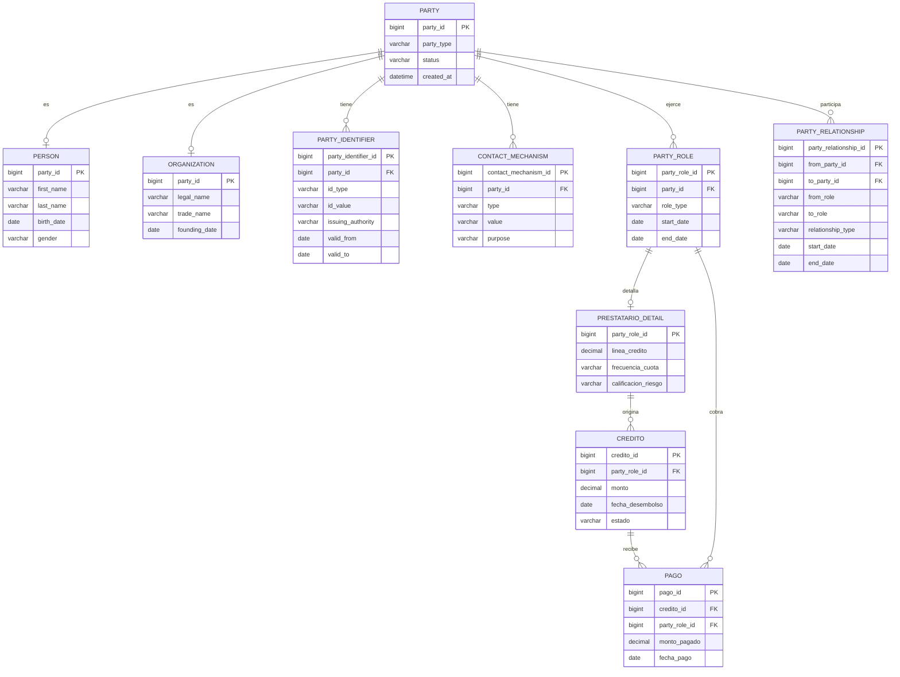
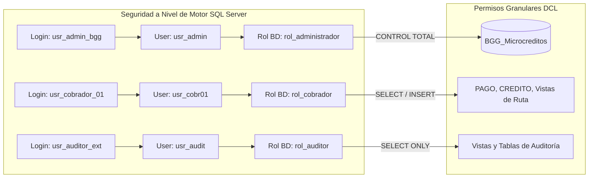

# CAPÍTULO V: METODOLOGÍA DE DESARROLLO

## 5.1. REQUERIMIENTOS DEL NEGOCIO

### 5.1.1. Matriz de Requerimientos Funcionales (RF)

| Código | Nombre del Requerimiento | Descripción Técnica | Prioridad |
|:---:|:---|:---|:---:|
| **RF-01** | **Gestión de Identidad Centralizada** | El sistema debe registrar a cada persona u organización en una única tupla de la tabla `PARTY`, heredando a `PERSON` u `ORGANIZATION` según su tipo ontológico. | Alta |
| **RF-02** | **Registro Multidocumento** | El sistema debe permitir registrar uno o varios documentos oficiales de identidad (DNI, RUC, CE) asociados a un único `party_id` en `PARTY_IDENTIFIER`. | Alta |
| **RF-03** | **Gestión Dinámica de Roles** | El sistema debe posibilitar la asignación, suspensión o revocación de roles de negocio (`CLIENTE`, `PRESTATARIO`, `AVAL`, `COBRADOR`) mediante ventanas de vigencia temporal (`start_date`, `end_date`). | Alta |
| **RF-04** | **Configuración de Prestatario** | El sistema debe almacenar el detalle financiero del prestatario (`linea_credito`, `frecuencia_cuota`, `calificacion_riesgo`) vinculado exclusivamente a su rol de prestatario activo. | Alta |
| **RF-05** | **Originación y Desembolso de Créditos** | El sistema debe registrar la colocación de un microcrédito (`monto`, `fecha_desembolso`, `estado`), validando que el prestatario cuente con línea de crédito suficiente y no presente morosidad. | Alta |
| **RF-06** | **Trazabilidad y Auditoría de Avales** | El sistema debe modelar la relación de garantía en `PARTY_RELATIONSHIP` (`relationship_type = 'AVAL'`), validando que una persona no se auto-avale y no exceda 3 garantías simultáneas activas. | Alta |
| **RF-07** | **Asignación de Rutas de Cobranza** | El sistema debe permitir asignar un cobrador activo a un prestatario en `PARTY_RELATIONSHIP` (`relationship_type = 'COBRANZA_ASIGNADA'`), conservando el historial ante reasignaciones de zona. | Media |
| **RF-08** | **Recaudación y Registro de Pagos** | El sistema debe registrar atómicamente cada pago recibido en ruta, vinculando el `credito_id`, el cobrador receptor (`party_role_id`), monto y fecha exacta de recaudación. | Alta |
| **RF-09** | **Consulta de Posición Consolidada** | El sistema debe proveer vistas para consultar en tiempo real el historial crediticio de una persona, incluyendo sus créditos propios y aquellos donde actúa como aval. | Media |
| **RF-10** | **Control y Cierre de Vigencias** | El sistema debe prohibir la eliminación física de registros (`DELETE`), implementando bajas lógicas mediante el registro de fechas de fin (`end_date = CURRENT_TIMESTAMP`). | Alta |

### 5.1.2. Matriz de Requerimientos No Funcionales (RNF)

| Código | Requerimiento No Funcional | Especificación Técnica |
|:---:|:---|:---|
| **RNF-01** | **Rendimiento y Latencia** | Las consultas transaccionales de validación de identidad y registro de pagos deben responder en un tiempo inferior a 150 milisegundos bajo concurrencia normal. |
| **RNF-02** | **Integridad Transaccional ACID** | Toda operación de colocación de crédito o registro de pago debe ejecutarse bajo control transaccional estricto en SQL Server, garantizando consistencia absoluta. |
| **RNF-03** | **Seguridad y Control de Acceso** | El acceso a la base de datos debe estar segregado por roles (RBAC) con permisos DCL mínimos necesarios (`GRANT`/`REVOKE`) según el perfil del usuario. |
| **RNF-04** | **Disponibilidad y Recuperabilidad** | La estrategia de copias de seguridad debe garantizar un Punto Objetivo de Recuperación (RPO) $\le$ 15 minutos y un Tiempo Objetivo de Recuperación (RTO) $\le$ 30 minutos. |
| **RNF-05** | **Normalización Formal** | El esquema de base de datos debe cumplir rigurosamente con la Tercera Forma Normal (3FN) y la Forma Normal de Boyce-Codd (BCNF). |
| **RNF-06** | **Portabilidad y Compatibilidad** | Los scripts DDL y DML deben ser 100% compatibles con Microsoft SQL Server 2019/2022 Developer y Standard Editions. |

### 5.1.3. Instrumentos de Recolección de Datos
Para el levantamiento de información operativa se diseñó una guía de entrevista semiestructurada aplicada a la administración y supervisión de BGG, enfocada en:
1. *Mecanismo actual de archivo:* Registro manual en cuadernos y hojas de Excel por cada cobrador.
2. *Tratamiento de avales:* Ausencia de cruce de datos entre zonas de cobro ante avales insolventes.
3. *Régimen de amortización:* Préstamos a 20 o 30 días con cobro diario de lunes a sábado.
4. *Puntos de dolor:* Descuadres de caja al liquidar el día, pérdida de cartillas físicas y reclamos de clientes por pagos no asentados.

---

## 5.2. IDENTIFICACIÓN DE STAKEHOLDERS

| Stakeholder / Actor | Rol Organizacional | Interés en el Sistema | Grado de Influencia / Impacto |
|:---|:---|:---|:---:|
| **Administrador General** | Dirección y Gerencia de BGG | Control global del negocio, reducción de mora, rentabilidad y mitigación de riesgos legales. | Alto / Crítico |
| **Supervisor de Créditos** | Evaluación y Aprobación | Consulta consolidada de antecedentes del prestatario y verificación de avales activos en tiempo real. | Alto |
| **Cobrador de Campo** | Operatividad en Ruta | Registro ágil de cuotas cobradas, consulta de su ruta diaria asignada y liquidación transparente de caja. | Medio |
| **Prestatario (Cliente)** | Deudor del Microcrédito | Registro fidedigno de sus amortizaciones, estado de cuenta actualizado y salvaguarda de sus datos. | Medio |
| **Garante / Aval** | Respaldo Crediticio | Notificación y control de las obligaciones garantizadas, evitando afectaciones patrimoniales indebidas. | Bajo |
| **DBA / Ingeniero de Datos** | Mantenimiento y Soporte | Aseguramiento de integridad referencial, monitoreo de rendimiento, seguridad DCL y ejecución de backups. | Alto |

---

## 5.3. MODELO CONCEPTUAL

### 5.3.1. Identificación de Entidades
1. **PARTY:** Entidad superclase que representa a cualquier sujeto de derecho (persona natural o jurídica) con existencia propia en el dominio del negocio.
2. **PERSON:** Subclase especializada que almacena los atributos biográficos exclusivos de seres humanos.
3. **ORGANIZATION:** Subclase especializada que contiene los atributos de personas jurídicas y entidades comerciales.
4. **PARTY_IDENTIFIER:** Entidad satélite que almacena los documentos oficiales de identificación gubernamental.
5. **CONTACT_MECHANISM:** Entidad satélite que gestiona los canales de comunicación y localización geográfica.
6. **PARTY_ROLE:** Entidad fundamental que modela las funciones dinámicas y temporales que asume una parte.
7. **PRESTATARIO_DETAIL:** Entidad de detalle que complementa el rol de prestatario con parámetros de riesgo y crédito.
8. **PARTY_RELATIONSHIP:** Entidad asociativa que modela las relaciones dirigidas y temporales entre dos partes.
9. **CREDITO:** Entidad transaccional que registra la colocación de fondos financieros amortizables.
10. **PAGO:** Entidad transaccional que captura los eventos individuales de recaudación monetaria en ruta.

### 5.3.2. Identificación de Atributos
- **PARTY:** `party_id` (PK, numérico), `party_type` (texto), `status` (texto), `created_at` (fecha/hora).
- **PERSON:** `party_id` (PK/FK, numérico), `first_name` (texto), `last_name` (texto), `birth_date` (fecha), `gender` (texto).
- **ORGANIZATION:** `party_id` (PK/FK, numérico), `legal_name` (texto), `trade_name` (texto), `founding_date` (fecha).
- **PARTY_IDENTIFIER:** `party_identifier_id` (PK, numérico), `party_id` (FK, numérico), `id_type` (texto), `id_value` (texto), `issuing_authority` (texto), `valid_from` (fecha), `valid_to` (fecha).
- **CONTACT_MECHANISM:** `contact_mechanism_id` (PK, numérico), `party_id` (FK, numérico), `type` (texto), `value` (texto), `purpose` (texto).
- **PARTY_ROLE:** `party_role_id` (PK, numérico), `party_id` (FK, numérico), `role_type` (texto), `start_date` (fecha), `end_date` (fecha).
- **PRESTATARIO_DETAIL:** `party_role_id` (PK/FK, numérico), `linea_credito` (decimal), `frecuencia_cuota` (texto), `calificacion_riesgo` (texto).
- **PARTY_RELATIONSHIP:** `party_relationship_id` (PK, numérico), `from_party_id` (FK, numérico), `to_party_id` (FK, numérico), `from_role` (texto), `to_role` (texto), `relationship_type` (texto), `start_date` (fecha), `end_date` (fecha).
- **CREDITO:** `credito_id` (PK, numérico), `party_role_id` (FK, numérico), `monto` (decimal), `fecha_desembolso` (fecha), `estado` (texto).
- **PAGO:** `pago_id` (PK, numérico), `credito_id` (FK, numérico), `party_role_id` (FK, numérico - cobrador), `monto_pagado` (decimal), `fecha_pago` (fecha).

### 5.3.3. Identificación de Relaciones
- Una `PARTY` **es** exactamente una `PERSON` o una `ORGANIZATION` (Especialización exclusiva 1:0..1).
- Una `PARTY` **posee** uno o muchos `PARTY_IDENTIFIER` (1:1..N).
- Una `PARTY` **dispone de** cero, uno o muchos `CONTACT_MECHANISM` (1:0..N).
- Una `PARTY` **ejerce** uno o muchos `PARTY_ROLE` a lo largo del tiempo (1:1..N).
- Una `PARTY` **participa como origen o destino** en cero o muchas `PARTY_RELATIONSHIP` (1:0..N).
- Un `PARTY_ROLE` de tipo Prestatario **se especializa en** exactamente un `PRESTATARIO_DETAIL` (1:0..1).
- Un `PRESTATARIO_DETAIL` **origina** uno o muchos `CREDITO` (1:0..N).
- Un `CREDITO` **recibe** uno o muchos `PAGO` (1:0..N).
- Un `PARTY_ROLE` de tipo Cobrador **recauda** cero o muchos `PAGO` (1:0..N).

### 5.5.4. Identificación de Cardinalidad
> *Nota de tipografía: Se conserva el numeral 5.5.4 de acuerdo con el formato original de la plantilla oficial del informe.*

- `PARTY` (1,1) ------ (0,1) `PERSON`
- `PARTY` (1,1) ------ (0,1) `ORGANIZATION`
- `PARTY` (1,1) ------ (0,N) `PARTY_IDENTIFIER`
- `PARTY` (1,1) ------ (0,N) `CONTACT_MECHANISM`
- `PARTY` (1,1) ------ (1,N) `PARTY_ROLE`
- `PARTY` (1,1) ------ (0,N) `PARTY_RELATIONSHIP` (origen: `from_party_id`)
- `PARTY` (1,1) ------ (0,N) `PARTY_RELATIONSHIP` (destino: `to_party_id`)
- `PARTY_ROLE` (1,1) ------ (0,1) `PRESTATARIO_DETAIL`
- `PRESTATARIO_DETAIL` (1,1) ------ (0,N) `CREDITO`
- `CREDITO` (1,1) ------ (0,N) `PAGO`
- `PARTY_ROLE` (Cobrador) (1,1) ------ (0,N) `PAGO`

### 5.3.5. Limitaciones del Modelo Conceptual
1. No se modelan árboles de parentesco complejos entre avales más allá del grafo dirigido formal de garantías.
2. Cada transacción de pago se asume ejecutada en moneda nacional (PEN - Soles peruanos); el modelo no implementa tipos de cambio multimoneda concurrentes.
3. Las amortizaciones se registran a nivel de cuotas monetarias globales hacia el crédito sin desglosar contablemente el interés moratorio en cuentas contables de orden.

---

## 5.4. MODELO LÓGICO

A continuación se inserta el Diagrama Entidad-Relación Lógico TO-BE validado para la entidad BGG:



### Diccionario de Datos Lógico

| Entidad | Campo / Atributo | Tipo Lógico | Restricción / Clave | Descripción del Campo |
|:---|:---|:---|:---:|:---|
| **PARTY** | `party_id` | BIGINT | PK | Identificador único global y subrogado de la parte. |
| | `party_type` | VARCHAR(20) | NOT NULL, CHECK | Tipo de parte: `'PERSON'` u `'ORGANIZATION'`. |
| | `status` | VARCHAR(20) | NOT NULL, DEFAULT | Estado administrativo: `'ACTIVE'`, `'INACTIVE'`. |
| | `created_at` | DATETIME | NOT NULL | Fecha y hora de registro en el sistema. |
| **PERSON** | `party_id` | BIGINT | PK, FK (PARTY) | Identificador heredado de PARTY (1:1). |
| | `first_name` | VARCHAR(100) | NOT NULL | Nombres completos de la persona natural. |
| | `last_name` | VARCHAR(100) | NOT NULL | Apellidos completos de la persona natural. |
| | `birth_date` | DATE | NULL | Fecha de nacimiento para cálculo de edad. |
| | `gender` | VARCHAR(10) | NULL | Género biográfico (`'M'`, `'F'`). |
| **ORGANIZATION**| `party_id` | BIGINT | PK, FK (PARTY) | Identificador heredado de PARTY (1:1). |
| | `legal_name` | VARCHAR(200) | NOT NULL | Razón social legal inscrita en SUNAT. |
| | `trade_name` | VARCHAR(200) | NULL | Nombre comercial del negocio o establecimiento. |
| | `founding_date` | DATE | NULL | Fecha de constitución o inicio de actividades. |
| **PARTY_IDENTIFIER** | `party_identifier_id` | BIGINT | PK | Clave subrogada del documento. |
| | `party_id` | BIGINT | FK (PARTY), NOT NULL | Parte a la que pertenece el documento. |
| | `id_type` | VARCHAR(30) | NOT NULL | Tipo de documento: `'DNI'`, `'RUC'`, `'CE'`. |
| | `id_value` | VARCHAR(50) | NOT NULL | Valor alfanumérico del documento de identidad. |
| | `issuing_authority` | VARCHAR(100) | NULL | Entidad emisora: `'RENIEC'`, `'SUNAT'`, etc. |
| | `valid_from` | DATE | NULL | Fecha de inicio de validez del documento. |
| | `valid_to` | DATE | NULL | Fecha de caducidad del documento. |
| **CONTACT_MECHANISM** | `contact_mechanism_id` | BIGINT | PK | Clave subrogada del mecanismo de contacto. |
| | `party_id` | BIGINT | FK (PARTY), NOT NULL | Parte asociada al contacto. |
| | `type` | VARCHAR(20) | NOT NULL | Tipo de contacto: `'PHONE'`, `'EMAIL'`, `'ADDRESS'`. |
| | `value` | VARCHAR(255) | NOT NULL | Valor del contacto (número, correo o dirección). |
| | `purpose` | VARCHAR(30) | NULL | Propósito: `'PERSONAL'`, `'COBRANZA'`, `'TRABAJO'`. |
| **PARTY_ROLE** | `party_role_id` | BIGINT | PK | Clave subrogada del rol de negocio. |
| | `party_id` | BIGINT | FK (PARTY), NOT NULL | Parte que ejerce la función operativa. |
| | `role_type` | VARCHAR(30) | NOT NULL | Rol: `'CLIENTE'`, `'PRESTATARIO'`, `'AVAL'`, `'COBRADOR'`. |
| | `start_date` | DATE | NOT NULL | Fecha de inicio en el ejercicio del rol. |
| | `end_date` | DATE | NULL | Fecha de cese o fin de vigencia del rol. |
| **PRESTATARIO_DETAIL** | `party_role_id` | BIGINT | PK, FK (PARTY_ROLE) | Clave vinculada a PARTY_ROLE cuando rol = PRESTATARIO. |
| | `linea_credito` | DECIMAL(12,2)| NOT NULL | Límite máximo de crédito autorizado en soles. |
| | `frecuencia_cuota` | VARCHAR(20) | NOT NULL | Periodicidad de pago: `'DIARIO'`, `'SEMANAL'`. |
| | `calificacion_riesgo`| VARCHAR(20) | NOT NULL | Nivel de riesgo crediticio: `'A'`, `'B'`, `'C'`. |
| **PARTY_RELATIONSHIP**| `party_relationship_id` | BIGINT | PK | Clave subrogada de la relación inter-partes. |
| | `from_party_id` | BIGINT | FK (PARTY), NOT NULL | Parte origen en el grafo relacional. |
| | `to_party_id` | BIGINT | FK (PARTY), NOT NULL | Parte destino en el grafo relacional. |
| | `from_role` | VARCHAR(30) | NOT NULL | Rol ejercido por el sujeto origen. |
| | `to_role` | VARCHAR(30) | NOT NULL | Rol ejercido por el sujeto destino. |
| | `relationship_type` | VARCHAR(30) | NOT NULL | Vínculo: `'AVAL'`, `'EMPLOYMENT'`, `'COBRANZA_ASIGNADA'`. |
| | `start_date` | DATE | NOT NULL | Fecha de inicio de la relación. |
| | `end_date` | DATE | NULL | Fecha de conclusión de la relación. |
| **CREDITO** | `credito_id` | BIGINT | PK | Clave primaria del préstamo otorgado. |
| | `party_role_id` | BIGINT | FK (PRESTATARIO_DETAIL)| Prestatario que contrae la obligación financiera. |
| | `monto` | DECIMAL(12,2)| NOT NULL, CHECK (>0) | Capital total prestado en soles. |
| | `fecha_desembolso` | DATE | NOT NULL | Fecha efectiva de entrega del capital. |
| | `estado` | VARCHAR(20) | NOT NULL | Estado del crédito: `'VIGENTE'`, `'CANCELADO'`, `'MOROSO'`. |
| **PAGO** | `pago_id` | BIGINT | PK | Clave primaria del evento de recaudación. |
| | `credito_id` | BIGINT | FK (CREDITO), NOT NULL | Crédito que se amortiza. |
| | `party_role_id` | BIGINT | FK (PARTY_ROLE), NOT NULL | Cobrador que recaudó la cuota (`role_type = COBRADOR`).|
| | `monto_pagado` | DECIMAL(12,2)| NOT NULL, CHECK (>0) | Suma de dinero abonada en la cuota. |
| | `fecha_pago` | DATE | NOT NULL | Fecha exacta de la recaudación en ruta. |

---

## 5.5. NORMALIZACIÓN

El diseño de la base de datos de BGG demuestra formalmente cómo el paso del modelo tradicional disperso (**AS-IS**) hacia la arquitectura **PARTY (TO-BE)** alcanza de forma natural y matemática la normalización completa:

### 1. Diagnóstico del Modelo AS-IS (No Normalizado / 0FN)
En el modelo AS-IS existiría una tabla plana y desnormalizada del tipo:
`REGISTRO_PRESTAMO (id_prestamo, dni_cliente, nom_cliente, dir_cliente, tels_cliente, dni_aval, nom_aval, tel_aval, dni_cobrador, nom_cobrador, monto, cuota, fecha_pago_1, monto_1, fecha_pago_2, monto_2...)`
- **Violación de 1FN:** `tels_cliente` es un atributo multivalorado (no atómico) y existen grupos repetitivos para registrar múltiples pagos (`fecha_pago_N`, `monto_N`).
- **Violación de 2FN:** Los nombres del cliente, aval y cobrador dependen únicamente de sus respectivos documentos de identidad y no de la clave compuesta del préstamo o pago.
- **Violación de 3FN:** Existen severas dependencias transitivas; los datos domiciliarios y comerciales dependen del sujeto y no de la transacción crediticia.

### 2. Aplicación Formal de Formas Normales hacia el Patrón PARTY

#### Primera Forma Normal (1FN)
- **Regla:** Todo atributo debe ser atómico (indivisible) y no deben existir grupos repetitivos.
- **Solución en TO-BE:** Se extraen los mecanismos de contacto y documentos a tablas independientes (`CONTACT_MECHANISM`, `PARTY_IDENTIFIER`) donde cada tupla almacena un único valor escalar. Los pagos repetitivos se trasladan a tuplas individuales en la entidad `PAGO`.

#### Segunda Forma Normal (2FN)
- **Regla:** El esquema debe estar en 1FN y todo atributo que no sea clave debe depender funcionalmente de la totalidad de la clave primaria (eliminación de dependencias parciales).
- **Solución en TO-BE:** En el esquema PARTY, cada entidad dispone de una clave primaria artificial subrogada (`party_id`, `party_role_id`, `party_relationship_id`, `credito_id`, `pago_id`). Ningún atributo no clave depende de una porción de clave, erradicando cualquier dependencia parcial.

#### Tercera Forma Normal (3FN) y Forma Normal de Boyce-Codd (BCNF)
- **Regla:** El esquema debe estar en 2FN y no deben existir dependencias transitivas (ningún atributo no clave debe depender de otro atributo no clave: si $X \rightarrow Y$, entonces $X$ es superclave).
- **Solución en TO-BE:** Los datos biográficos de las personas (`first_name`, `last_name`, `birth_date`) dependen exclusivamente de `party_id` en la tabla `PERSON`. Los parámetros crediticios (`linea_credito`) dependen de `party_role_id` en `PRESTATARIO_DETAIL`. El vínculo de garantía depende exclusivamente de la tupla de relación `PARTY_RELATIONSHIP`. El patrón PARTY nace por definición en **3FN y BCNF**.

---

## 5.6. MODELO FÍSICO

A continuación se presenta el script DDL definitivo optimizado para el motor **Microsoft SQL Server 2022**, incorporando tipos de datos nativos T-SQL, claves subrogadas con `IDENTITY`, restricciones de integridad y checks de validación:

```sql
-- ============================================================================
-- SCRIPT DDL: BASE DE DATOS BGG - MODELO TO-BE (PATRÓN PARTY)
-- MOTOR: MICROSOFT SQL SERVER 2019 / 2022
-- ============================================================================

USE master;
GO

IF DB_ID('BGG_Microcreditos') IS NOT NULL
BEGIN
    ALTER DATABASE BGG_Microcreditos SET SINGLE_USER WITH ROLLBACK IMMEDIATE;
    DROP DATABASE BGG_Microcreditos;
END
GO

CREATE DATABASE BGG_Microcreditos;
GO

USE BGG_Microcreditos;
GO

-- 1. TABLA PARTY (SUPERCLASE ABSTRACTA DE IDENTIDAD)
CREATE TABLE PARTY (
    party_id BIGINT IDENTITY(1,1) NOT NULL,
    party_type VARCHAR(20) NOT NULL,
    status VARCHAR(20) NOT NULL CONSTRAINT DF_PARTY_status DEFAULT 'ACTIVE',
    created_at DATETIME2(7) NOT NULL CONSTRAINT DF_PARTY_created_at DEFAULT SYSDATETIME(),
    CONSTRAINT PK_PARTY PRIMARY KEY CLUSTERED (party_id),
    CONSTRAINT CK_PARTY_party_type CHECK (party_type IN ('PERSON', 'ORGANIZATION')),
    CONSTRAINT CK_PARTY_status CHECK (status IN ('ACTIVE', 'INACTIVE', 'SUSPENDED'))
);
GO

-- 2. TABLA PERSON (SUBCLASE ESPECIALIZADA: PERSONA NATURAL)
CREATE TABLE PERSON (
    party_id BIGINT NOT NULL,
    first_name VARCHAR(100) NOT NULL,
    last_name VARCHAR(100) NOT NULL,
    birth_date DATE NULL,
    gender VARCHAR(10) NULL,
    CONSTRAINT PK_PERSON PRIMARY KEY CLUSTERED (party_id),
    CONSTRAINT FK_PERSON_PARTY FOREIGN KEY (party_id) REFERENCES PARTY(party_id) ON DELETE NO ACTION,
    CONSTRAINT CK_PERSON_gender CHECK (gender IN ('M', 'F', 'OTHER'))
);
GO

-- 3. TABLA ORGANIZATION (SUBCLASE ESPECIALIZADA: PERSONA JURÍDICA / COMERCIO)
CREATE TABLE ORGANIZATION (
    party_id BIGINT NOT NULL,
    legal_name VARCHAR(200) NOT NULL,
    trade_name VARCHAR(200) NULL,
    founding_date DATE NULL,
    CONSTRAINT PK_ORGANIZATION PRIMARY KEY CLUSTERED (party_id),
    CONSTRAINT FK_ORGANIZATION_PARTY FOREIGN KEY (party_id) REFERENCES PARTY(party_id) ON DELETE NO ACTION
);
GO

-- 4. TABLA PARTY_IDENTIFIER (DOCUMENTOS DE IDENTIDAD DESACOPLADOS)
CREATE TABLE PARTY_IDENTIFIER (
    party_identifier_id BIGINT IDENTITY(1,1) NOT NULL,
    party_id BIGINT NOT NULL,
    id_type VARCHAR(30) NOT NULL,
    id_value VARCHAR(50) NOT NULL,
    issuing_authority VARCHAR(100) NULL,
    valid_from DATE NULL,
    valid_to DATE NULL,
    CONSTRAINT PK_PARTY_IDENTIFIER PRIMARY KEY CLUSTERED (party_identifier_id),
    CONSTRAINT FK_PARTY_IDENTIFIER_PARTY FOREIGN KEY (party_id) REFERENCES PARTY(party_id),
    CONSTRAINT UQ_PARTY_IDENTIFIER_type_value UNIQUE NONCLUSTERED (id_type, id_value),
    CONSTRAINT CK_PARTY_IDENTIFIER_type CHECK (id_type IN ('DNI', 'RUC', 'CE', 'PASSPORT'))
);
GO

-- 5. TABLA CONTACT_MECHANISM (MECANISMOS DE CONTACTO SATÉLITE)
CREATE TABLE CONTACT_MECHANISM (
    contact_mechanism_id BIGINT IDENTITY(1,1) NOT NULL,
    party_id BIGINT NOT NULL,
    type VARCHAR(20) NOT NULL,
    value VARCHAR(255) NOT NULL,
    purpose VARCHAR(30) NULL,
    CONSTRAINT PK_CONTACT_MECHANISM PRIMARY KEY CLUSTERED (contact_mechanism_id),
    CONSTRAINT FK_CONTACT_MECHANISM_PARTY FOREIGN KEY (party_id) REFERENCES PARTY(party_id),
    CONSTRAINT CK_CONTACT_MECHANISM_type CHECK (type IN ('PHONE', 'EMAIL', 'ADDRESS'))
);
GO

-- 6. TABLA PARTY_ROLE (ROLES DINÁMICOS Y TEMPORALES)
CREATE TABLE PARTY_ROLE (
    party_role_id BIGINT IDENTITY(1,1) NOT NULL,
    party_id BIGINT NOT NULL,
    role_type VARCHAR(30) NOT NULL,
    start_date DATE NOT NULL CONSTRAINT DF_PARTY_ROLE_start_date DEFAULT CAST(SYSDATETIME() AS DATE),
    end_date DATE NULL,
    CONSTRAINT PK_PARTY_ROLE PRIMARY KEY CLUSTERED (party_role_id),
    CONSTRAINT FK_PARTY_ROLE_PARTY FOREIGN KEY (party_id) REFERENCES PARTY(party_id),
    CONSTRAINT CK_PARTY_ROLE_role_type CHECK (role_type IN ('CLIENTE', 'PRESTATARIO', 'AVAL', 'COBRADOR')),
    CONSTRAINT CK_PARTY_ROLE_dates CHECK (end_date IS NULL OR end_date >= start_date)
);
GO

-- 7. TABLA PARTY_RELATIONSHIP (GRAFO DIRIGIDO DE RELACIONES ENTRE PARTES)
CREATE TABLE PARTY_RELATIONSHIP (
    party_relationship_id BIGINT IDENTITY(1,1) NOT NULL,
    from_party_id BIGINT NOT NULL,
    to_party_id BIGINT NOT NULL,
    from_role VARCHAR(30) NOT NULL,
    to_role VARCHAR(30) NOT NULL,
    relationship_type VARCHAR(30) NOT NULL,
    start_date DATE NOT NULL CONSTRAINT DF_PARTY_RELATIONSHIP_start_date DEFAULT CAST(SYSDATETIME() AS DATE),
    end_date DATE NULL,
    CONSTRAINT PK_PARTY_RELATIONSHIP PRIMARY KEY CLUSTERED (party_relationship_id),
    CONSTRAINT FK_PARTY_RELATIONSHIP_from_party FOREIGN KEY (from_party_id) REFERENCES PARTY(party_id),
    CONSTRAINT FK_PARTY_RELATIONSHIP_to_party FOREIGN KEY (to_party_id) REFERENCES PARTY(party_id),
    CONSTRAINT CK_PARTY_RELATIONSHIP_no_self CHECK (from_party_id <> to_party_id),
    CONSTRAINT CK_PARTY_RELATIONSHIP_type CHECK (relationship_type IN ('AVAL', 'EMPLOYMENT', 'COBRANZA_ASIGNADA')),
    CONSTRAINT CK_PARTY_RELATIONSHIP_dates CHECK (end_date IS NULL OR end_date >= start_date)
);
GO

-- 8. TABLA PRESTATARIO_DETAIL (EXTENSIÓN FINANCIERA DEL ROL PRESTATARIO)
CREATE TABLE PRESTATARIO_DETAIL (
    party_role_id BIGINT NOT NULL,
    linea_credito DECIMAL(12,2) NOT NULL CONSTRAINT DF_PRESTATARIO_linea DEFAULT 0.00,
    frecuencia_cuota VARCHAR(20) NOT NULL CONSTRAINT DF_PRESTATARIO_frecuencia DEFAULT 'DIARIO',
    calificacion_riesgo VARCHAR(20) NOT NULL CONSTRAINT DF_PRESTATARIO_riesgo DEFAULT 'A',
    CONSTRAINT PK_PRESTATARIO_DETAIL PRIMARY KEY CLUSTERED (party_role_id),
    CONSTRAINT FK_PRESTATARIO_DETAIL_PARTY_ROLE FOREIGN KEY (party_role_id) REFERENCES PARTY_ROLE(party_role_id),
    CONSTRAINT CK_PRESTATARIO_linea CHECK (linea_credito >= 0),
    CONSTRAINT CK_PRESTATARIO_frecuencia CHECK (frecuencia_cuota IN ('DIARIO', 'SEMANAL')),
    CONSTRAINT CK_PRESTATARIO_riesgo CHECK (calificacion_riesgo IN ('A', 'B', 'C', 'D', 'E'))
);
GO

-- 9. TABLA CREDITO (ORIGINACIÓN DE MICROCRÉDITOS)
CREATE TABLE CREDITO (
    credito_id BIGINT IDENTITY(1,1) NOT NULL,
    party_role_id BIGINT NOT NULL,
    monto DECIMAL(12,2) NOT NULL,
    fecha_desembolso DATE NOT NULL CONSTRAINT DF_CREDITO_fecha DEFAULT CAST(SYSDATETIME() AS DATE),
    estado VARCHAR(20) NOT NULL CONSTRAINT DF_CREDITO_estado DEFAULT 'VIGENTE',
    CONSTRAINT PK_CREDITO PRIMARY KEY CLUSTERED (credito_id),
    CONSTRAINT FK_CREDITO_PRESTATARIO FOREIGN KEY (party_role_id) REFERENCES PRESTATARIO_DETAIL(party_role_id),
    CONSTRAINT CK_CREDITO_monto CHECK (monto > 0),
    CONSTRAINT CK_CREDITO_estado CHECK (estado IN ('VIGENTE', 'CANCELADO', 'MOROSO'))
);
GO

-- 10. TABLA PAGO (RECAUDACIÓN TRANSACCIONAL DE CUOTAS EN RUTA)
CREATE TABLE PAGO (
    pago_id BIGINT IDENTITY(1,1) NOT NULL,
    credito_id BIGINT NOT NULL,
    party_role_id BIGINT NOT NULL, -- Cobrador que recaudó
    monto_pagado DECIMAL(12,2) NOT NULL,
    fecha_pago DATE NOT NULL CONSTRAINT DF_PAGO_fecha DEFAULT CAST(SYSDATETIME() AS DATE),
    CONSTRAINT PK_PAGO PRIMARY KEY CLUSTERED (pago_id),
    CONSTRAINT FK_PAGO_CREDITO FOREIGN KEY (credito_id) REFERENCES CREDITO(credito_id),
    CONSTRAINT FK_PAGO_COBRADOR FOREIGN KEY (party_role_id) REFERENCES PARTY_ROLE(party_role_id),
    CONSTRAINT CK_PAGO_monto CHECK (monto_pagado > 0)
);
GO

-- CREACIÓN DE ÍNDICES NO AGRUPADOS PARA OPTIMIZACIÓN DE CONSULTAS
CREATE NONCLUSTERED INDEX IX_PARTY_IDENTIFIER_party_id ON PARTY_IDENTIFIER(party_id);
CREATE NONCLUSTERED INDEX IX_PARTY_ROLE_party_id ON PARTY_ROLE(party_id);
CREATE NONCLUSTERED INDEX IX_PARTY_RELATIONSHIP_from_to ON PARTY_RELATIONSHIP(from_party_id, to_party_id, relationship_type);
CREATE NONCLUSTERED INDEX IX_CREDITO_party_role_id ON CREDITO(party_role_id, estado);
CREATE NONCLUSTERED INDEX IX_PAGO_credito_id ON PAGO(credito_id);
CREATE NONCLUSTERED INDEX IX_PAGO_party_role_id ON PAGO(party_role_id);
GO
```

---

## 5.7. MIGRACIÓN AL GESTOR DE BASE DE DATOS

El despliegue del modelo físico se efectuó sobre una instancia local y contenerizada de **Microsoft SQL Server 2022**. La estrategia de migración consideró los siguientes pasos de ingeniería:
1. **Verificación de Dependencias Topológicas:** Se ejecutaron las instrucciones de creación siguiendo el orden topológico estricto (de superclase a subclase y de entidades fuertes a entidades débiles/transaccionales) para evitar errores de claves foráneas no resueltas.
2. **Poblado de Datos Iniciales (Seed Data):** Se cargaron datos estructurados representativos para personas naturales, prestatarios, cobradores de ruta, avales cruzados y transacciones de crédito y pago.
3. **Validación de Integridad:** Se realizaron pruebas de inserción violando deliberadamente restricciones (`CHECK`, auto-avales y documentos duplicados) confirmando el bloqueo inmediato por parte del motor relacional.

---

## 5.8. POLÍTICAS DE SEGURIDAD DE USUARIO

Para garantizar el principio de menor privilegio y la confidencialidad de la información, se implementó un modelo de seguridad basado en roles (RBAC) en Microsoft SQL Server, diferenciando formalmente los **roles del motor de base de datos** de los **roles de negocio** (`PARTY_ROLE`):



### Script de Implementación de Seguridad DCL en SQL Server

```sql
-- CREACIÓN DE ROLES DE BASE DE DATOS
CREATE ROLE rol_administrador;
CREATE ROLE rol_cobrador;
CREATE ROLE rol_auditor;
GO

-- ASIGNACIÓN DE PRIVILEGIOS AL ROL ADMINISTRADOR (GESTIÓN TOTAL)
GRANT CONTROL TO rol_administrador;
GO

-- ASIGNACIÓN DE PRIVILEGIOS AL ROL COBRADOR (OPERACIÓN EN RUTA)
GRANT SELECT ON PARTY TO rol_cobrador;
GRANT SELECT ON PERSON TO rol_cobrador;
GRANT SELECT ON CONTACT_MECHANISM TO rol_cobrador;
GRANT SELECT ON CREDITO TO rol_cobrador;
GRANT SELECT, INSERT ON PAGO TO rol_cobrador;
GRANT SELECT ON PARTY_RELATIONSHIP TO rol_cobrador;
DENY DELETE, UPDATE ON PAGO TO rol_cobrador;
DENY ALTER ON SCHEMA::dbo TO rol_cobrador;
GO

-- ASIGNACIÓN DE PRIVILEGIOS AL ROL AUDITOR (SOLO LECTURA)
GRANT SELECT TO rol_auditor;
DENY INSERT, UPDATE, DELETE TO rol_auditor;
GO
```

---

## 5.9. PLAN DE BACKUPS Y RECUPERACIÓN ANTE FALLOS

### 5.9.1. Estrategia y Topología de Respaldos
La operación de BGG requiere una protección continua contra fallas de hardware, errores humanos o corrupción de almacenamiento:
- **Modelo de Recuperación:** `FULL` (Permite restauración puntual en el tiempo).
- **Copia de Seguridad Completa (Full Backup):** Ejecutada semanalmente cada domingo a las 00:00 horas.
- **Copia de Seguridad Diferencial:** Ejecutada diariamente de lunes a sábado a las 23:00 horas (captura los cambios desde el último Full).
- **Copia del Registro de Transacciones (Transaction Log):** Ejecutada cada 15 minutos en el horario operativo de cobranza (07:00 a 20:00 horas).

### 5.9.2. Métricas de Continuidad Operativa
- **Punto Objetivo de Recuperación (RPO):** $\le$ 15 minutos (pérdida máxima de datos tolerada ante siniestro).
- **Tiempo Objetivo de Recuperación (RTO):** $\le$ 30 minutos (tiempo máximo para restaurar el servicio en un nodo secundario).

### 5.9.3. Scripts de Ejecución de Backups y Protocolo de Restauración

```sql
-- 1. CONFIGURAR BASE DE DATOS EN MODO DE RECUPERACIÓN FULL
ALTER DATABASE BGG_Microcreditos SET RECOVERY FULL;
GO

-- 2. RESPALDO COMPLETO (FULL BACKUP)
BACKUP DATABASE BGG_Microcreditos
TO DISK = 'C:\SQL_Backups\BGG_Full_Semanal.bak'
WITH FORMAT, MEDIANAME = 'BGG_Backup_Media', NAME = 'Full Backup Semanal BGG';
GO

-- 3. RESPALDO DIFERENCIAL (DIARIO)
BACKUP DATABASE BGG_Microcreditos
TO DISK = 'C:\SQL_Backups\BGG_Diff_Diario.bak'
WITH DIFFERENTIAL, NAME = 'Diferencial Diario BGG';
GO

-- 4. RESPALDO DEL REGISTRO DE TRANSACCIONES (CADA 15 MINUTOS)
BACKUP LOG BGG_Microcreditos
TO DISK = 'C:\SQL_Backups\BGG_Log_15min.trn'
WITH NAME = 'Log Backup 15min BGG';
GO

-- 5. PROTOCOLO DE RESTAURACIÓN ANTE DESASTRE (POINT-IN-TIME RECOVERY)
-- Paso A: Restaurar el Full con NORECOVERY
RESTORE DATABASE BGG_Microcreditos
FROM DISK = 'C:\SQL_Backups\BGG_Full_Semanal.bak'
WITH NORECOVERY, REPLACE;

-- Paso B: Restaurar el Diferencial más reciente con NORECOVERY
RESTORE DATABASE BGG_Microcreditos
FROM DISK = 'C:\SQL_Backups\BGG_Diff_Diario.bak'
WITH NORECOVERY;

-- Paso C: Restaurar los Logs transaccionales y poner la BD en línea con RECOVERY
RESTORE LOG BGG_Microcreditos
FROM DISK = 'C:\SQL_Backups\BGG_Log_15min.trn'
WITH RECOVERY;
GO
```

---

## 5.10. CONTRASTACIÓN DE REQUERIMIENTOS

La siguiente matriz de trazabilidad técnica valida el cumplimiento y cobertura integral de todos los requerimientos funcionales documentados frente a los artefactos físicos implementados en Microsoft SQL Server:

| Requerimiento del Proyecto | Artefacto de Base de Datos Implementado | Responsable de Implementación | Estado de Cumplimiento |
|:---|:---|:---|:---:|
| **RF-01: Gestión de Identidad Centralizada** | Tablas `PARTY`, `PERSON`, `ORGANIZATION` con herencia Class Table Inheritance y constraints de tipo. | Espinoza Morales, Jose Angel | **COMPLETADO** |
| **RF-02: Registro Multidocumento** | Tabla `PARTY_IDENTIFIER` con restricción `UNIQUE (id_type, id_value)` y checks de autoridad emisora. | Aquino Rivera, Oswaldo Jader | **COMPLETADO** |
| **RF-03: Gestión Dinámica de Roles** | Tabla `PARTY_ROLE` con atributos temporales (`start_date`, `end_date`) y checks de consistencia. | Espinoza Morales, Jose Angel | **COMPLETADO** |
| **RF-04: Configuración de Prestatario** | Tabla `PRESTATARIO_DETAIL` vinculada a `PARTY_ROLE` con límites de crédito y validación de riesgo. | Ramos Guerra, Jaime Eloy | **COMPLETADO** |
| **RF-05: Originación de Créditos** | Tabla `CREDITO` con clave foránea a `PRESTATARIO_DETAIL` y validación de monto positivo. | Aquino Rivera, Oswaldo Jader | **COMPLETADO** |
| **RF-06: Trazabilidad y Auditoría de Avales** | Tabla `PARTY_RELATIONSHIP` con tipo `'AVAL'`, restricción `CK_no_self` y vista de auditoría. | Espinoza Morales, Jose Angel | **COMPLETADO** |
| **RF-07: Asignación de Rutas de Cobranza** | Tabla `PARTY_RELATIONSHIP` con tipo `'COBRANZA_ASIGNADA'` y control temporal de vigencias. | Ramos Guerra, Jaime Eloy | **COMPLETADO** |
| **RF-08: Recaudación y Registro de Pagos** | Tabla `PAGO` con vinculación atómica de crédito, cobrador y monto estrictamente positivo. | León Ccahuana, Jeffre Carlos | **COMPLETADO** |
| **RF-09: Políticas de Seguridad Granular** | Roles de base de datos (`rol_administrador`, `rol_cobrador`, `rol_auditor`) y permisos DCL. | León Ccahuana, Jeffre Carlos | **COMPLETADO** |
| **RF-10: Plan de Contingencia y Backups** | Configuración de Recovery Model FULL y scripts ejecutables de respaldo Full, Diff y Log. | León Ccahuana, Jeffre Carlos | **COMPLETADO** |
